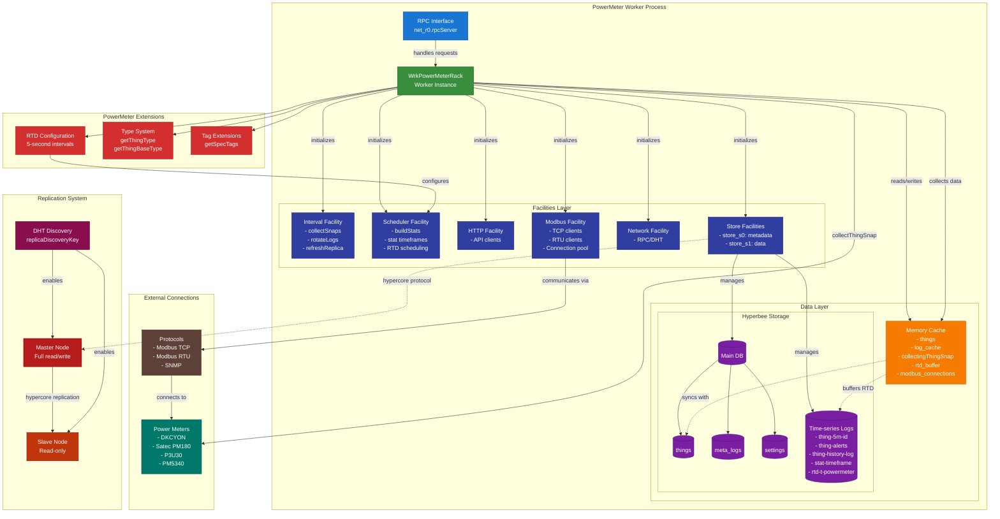
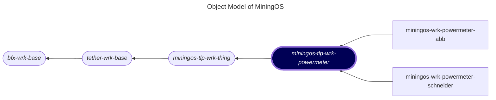

# miningos-tpl-wrk-powermeter

## Table of Contents

1. [Overview](#overview)
    1. [Purpose](#purpose)
    2. [Supported Power Meter Types](#supported-power-meter-types)
    3. [Simplified Layer View](#simplified-layer-view)
    4. [Detailed Component Architecture](#detailed-component-architecture)
2. [Architecture](#architecture)
    1. [Object Model](#object-model)
    2. [Worker Types](#worker-types)
    3. [Worker Lifecycle](#worker-lifecycle)
3. [Core Features](#core-features)
    1. [Real-Time Data (RTD) Collection](#real-time-data-rtd-collection)
    2. [Device Type Management](#device-type-management)
    3. [Tag System Integration](#tag-system-integration)

## Overview

The PowerMeter Worker Template (`WrkPowerMeterRack`) is a specialized abstract class that extends the base [Thing Worker framework](https://github.com/tetherto/miningos-tpl-wrk-thing) for managing power monitoring equipment in Bitcoin mining operations. It provides a foundation for implementing brand-specific power meter integrations while standardizing common functionality across different hardware models.

### Purpose

Power monitoring is critical in mining operations for:
- **Energy Efficiency**: Track power consumption per mining unit
- **Cost Management**: Monitor electricity costs in real-time
- **Preventive Maintenance**: Detect anomalies in power draw
- **Load Balancing**: Optimize power distribution across facilities

### Supported Power Meter Types

The template supports various industrial power meters commonly used in mining facilities, including, but not limited to:
- [**DKCYON**](https://github.com/tetherto/miningos-wrk-powermeter-dkcyon): Industrial power analyzers
- [**Satec PM180**](https://github.com/tetherto/miningos-wrk-powermeter-satec/): Multi-circuit power meters
- [**Schneider P3U30 and PM5340**](https://github.com/tetherto/miningos-wrk-powermeter-schneider/): Three-phase power monitors and advanced power quality meter respectively
- [**Various devics from Abb**](https://github.com/tetherto/miningos-wrk-powermeter-abb/).

### System Components

**Simplified Layer View:**
```
┌─────────────────────┐
│   RPC Interface     │
├─────────────────────┤
│ PowerMeter Worker   │
│ (WrkPowerMeterRack) │
├─────────────────────┤
│   Facilities Layer  │
│     Modbus/SNMP     │
├─────────────────────┤
│   Memory Cache      │
│     RTD Buffer      │
├─────────────────────┤
│   Storage Layer     │
│   (Hyperbee)        │
├─────────────────────┤
│   Replication       │
│   (Master/Slave)    │
└─────────────────────┘
```

The simplified view shows how the PowerMeter template extends the [base Thing Worker](https://github.com/tetherto/miningos-tpl-wrk-thing) architecture. The key additions, highlighed with leading "+" sign, are protocol facilities (Modbus/SNMP) in the Facilities Layer and RTD buffering in the Memory Cache. All other layers maintain their standard Thing Worker functionality, ensuring compatibility with the broader mining infrastructure management system.

**Detailed Component Architecture:**




This comprehensive architecture diagram illustrates how the PowerMeter template extends the [base Thing Worker](https://github.com/tetherto/miningos-tpl-wrk-thing). The PowerMeter Extensions section (3 red component in the top left) shows the key additions: **RTD configuration for 5-second data collection**, override parent class **type** for power meter categorization, and extended **tagging**.

## Architecture

### Object Model

The following is a fragment of [MiningOS object model](https://docs.mos.tether.io/) that contains the abstract class representing "Power Meter" (highlighted in blue). The rounded nodes reprsent abstract classes and the one square node represents a concrete class:


> Accordign to UML notation, abstract classes have their names in Italic. 'Stadium shape' applied for abstract class nodes for better visualization.

> Horizontal display was chosen over more conventional vertical one merely for purposes of better layout.

### Worker Types
The **PowerMeter** template fits in third level of the following standard inheritance hierarchy:

#### Inheritance Levels

```
Level 1: bfx-wrk-base (Foundation)
    ↓
Level 2: tether-wrk-base (Foundation)
    ↓
Level 3: miningos-tlp-wrk-thing/WrkProcVar (Thing Management Base)
    ↓
Level 4: miningos-tlp-wrk-powermeter (PowerMeter Template)
    ↓
Level 5: Brand Specific Implementations (in some cases model too)
    ↓
Level 6: Model Specific Implementations
```

#### Implementation Pattern

Each level provides increasing specialization:
- [**Level 1**](https://github.com/bitfinexcom/bfx-svc-boot-js): Provides worker infrastructure (lifecycle, facilities, configuration)
- [**Level 2**](https://github.com/tetherto/tether-wrk-base): Implements RPC server/client capabilities and allowlisting for incoming connections
- [**Level 3**](https://github.com/tetherto/miningos-tpl-wrk-thing/): Defines abstract methods like `connectThing()`, `collectThingSnap()`
- **Level 4**: (Current) Adds RTD configuration and type system for power meters
- **Level 5**: Implements brand-specific communication protocols
- **Level 6**: Implements model-specific communication protocols

#### Level 1: [Foundation](https://github.com/bitfinexcom/bfx-wrk-base)
- **bfx-wrk-base**: Core worker functionality (configuration, facilities, lifecycle)

#### Level 2: [Foundation](https://github.com/tetherto/tether-wrk-base)
- **tether-wrk-base**: Core worker functionality (configuration, facilities, lifecycle)

#### Level 3: [Thing Management Base](https://github.com/tetherto/miningos-tpl-wrk-thing)
- **miningos-tlp-wrk-thing (WrkProcVar)**: Abstract base implementing:
  - Thing CRUD operations
  - RPC interface
  - Storage management
  - Replication logic
  - Abstract methods for device interaction

#### Level 4: PowerMeter Template
- **miningos-tlp-wrk-powermeter (WrkPowerMeterRack)**: Power monitoring specialization:
  - RTD scheduling configuration
  - PowerMeter type definition
  - Tag system for power meters
  - Base methods remain abstract for brand implementation


#### Key Observations

1. **RTD Enhancement**: The 5-second RTD collection is seamlessly integrated into the standard statistics framework
2. **Protocol Integration**: Modbus facility is added during brand implementation initialization
3. **Dual Collection**: Maintains 60-second full snapshots while adding 5-second RTD
4. **Graceful Degradation**: If RTD fails, full snapshots continue unaffected

### Common Implementation Patterns

1. **Modbus TCP**: Most industrial power meters use Modbus
2. **Error Handling**: Graceful degradation on communication failures
3. **Configuration**: Device-specific settings passed via `thg.opts`
4. **Event-Driven**: Use EventEmitter for async error reporting
